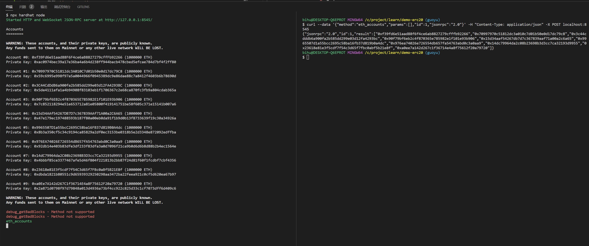
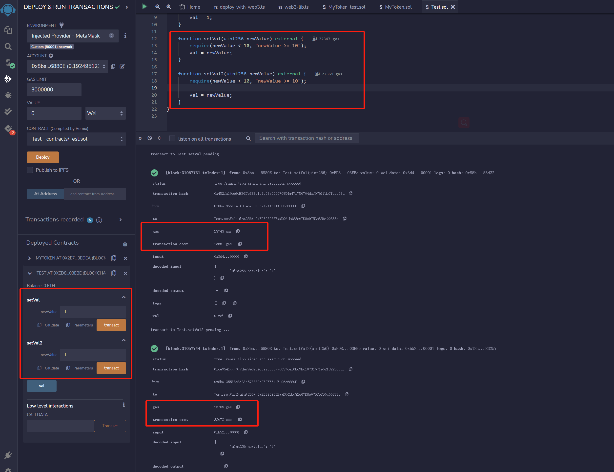
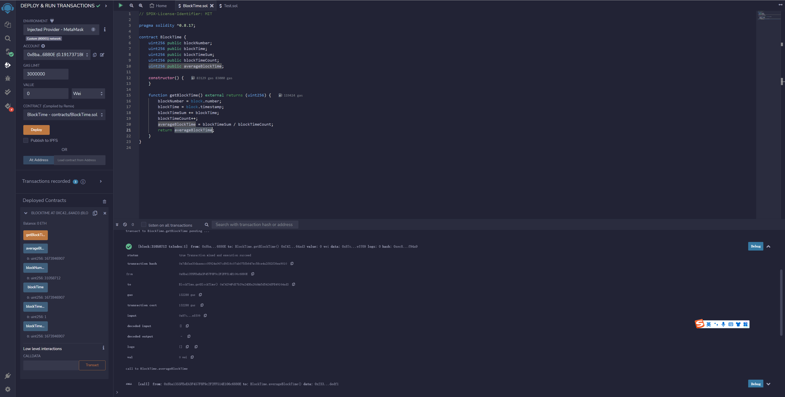
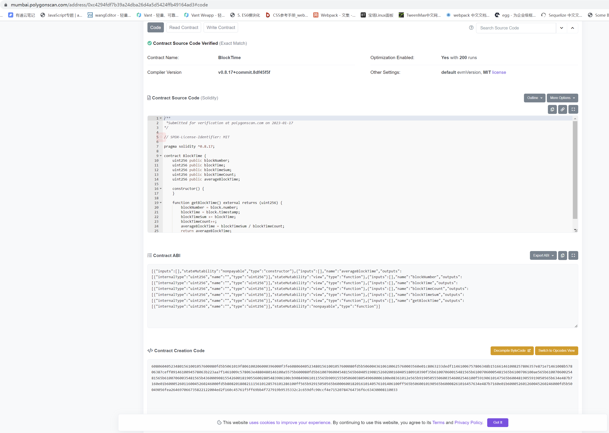
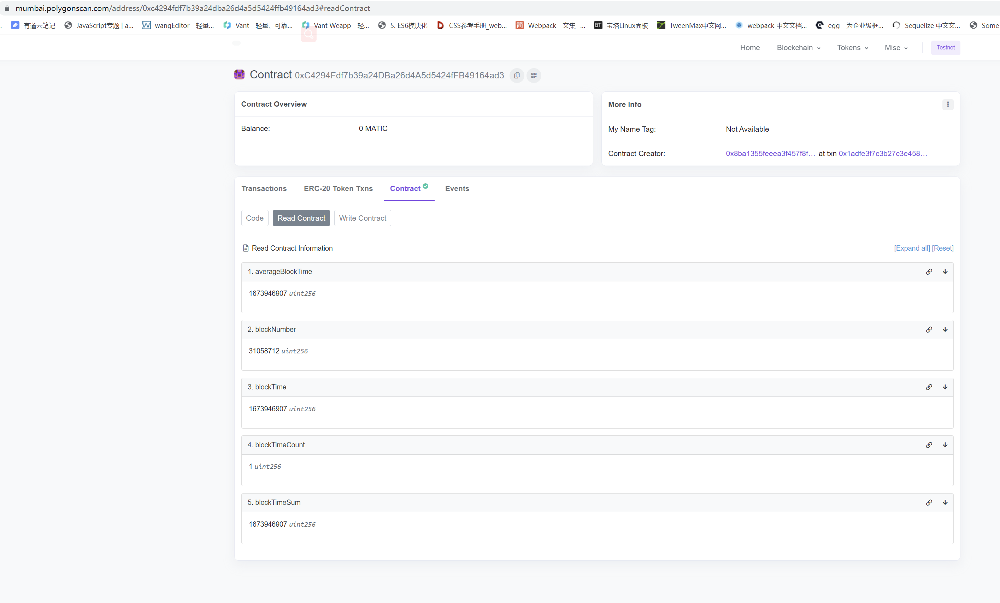

# 区块链培训作业

请大家 fork 本仓库后答题，做完后提交自己的软件仓库链接。

## 第 1 题：Solidity 语言有哪些数据类型？

例如：

-   bool
-   int8

评分标准：每个数据类型计 1 分  
参考资料： https://docs.soliditylang.org/en/latest/types.html

-   Solidity 支持以下类型：
    -   值类型
        -   整型：`int (8-256)`
            -   有符号 `int`
            -   无符号 `unint`
        -   无符号整型: `uint (8-256)`
        -   布尔型：`bool`
        -   地址类型：`address`
            -   `address`
            -   `address payable`
        -   定长字节数组：`bytes1 ~ bytes32`
        -   定长浮点型
            -   有符号 `fixed`
            -   无符号 `ufixed`
        -   有理数和整数字面常数
        -   枚举类型：`enum`
        -   函数：`Function`
        -   事件: `Event`
    -   引用类型
        -   数据位置
        -   数组类型：`Array` 数组可以是静态或动态
        -   结构体类型：`Struts`
        -   映射 `Mapping`
        -   不定长字节数组 `bytes`
        -   字符串类型：`string`

## 第 2 题：列举并测试以太坊的 JSONRPC API。

评分标准：每条有效的（提供文本命令和测试截图） API 计 2 分，例如：

---

第 1 个 API： net_version

```shell
curl -s -X POST -H "Content-Type: application/json" https://matic-mumbai.chainstacklabs.com \
-d '{"id":1,"jsonrpc":"2.0","method":"net_version","params":[]}' | jq
```


---

### 以太坊的 JSONRPC API

解题思路：

1. 用 hardhat 创建项目
2. 用 npx hardhat node 开启本地网络
3. 参考[官方文档](https://openethereum.github.io/JSONRPC-eth-module#eth_accounts)的 api，都有例子



太多了，就不一一截图了

## 第 3 题：同一个合约里代码相同的函数，为什么 GAS 费不同？

请用 Remix 验证在同一个合约里，名称不同、代码相同的函数的 GAS 费不相等，并解释原因。

评分标准：

-   验证成功： 10 分，对过程要截图
-   解释正确： 10 分

### 原因

-   函数的调用次数不同：在同一个合约里，如果某个函数被调用的次数更多，它所需要的 GAS 费用就会更高。
-   函数内部执行的复杂度不同：如果某个函数内部执行的操作更复杂，它所需要的 GAS 费用就会更高。
-   函数调用的时机不同：如果某个函数被调用的时机不同（例如在交易执行时或在智能合约执行时），它所需要的 GAS 费用也可能不同。
-   所调用的合约是否存在前后缀，在合约上会产生不同的存储开销，引起 GAS 费用不同。
-   当前区块的 Gas Price 也会对 GAS 费用产生影响
-   确切的 GAS 费用需要在进行测算或者实际部署测试才能确定。

### 实践图片



## 第 4 题：用 Remix 部署校验合约

用 Remix 写一个合约，部署到 mumbai 链上，计算 mumbai 链的最近平均出块时间，并校验合约代码代码。

评分标准：

-   代码正确：截图 10 分
-   部署成功：截图 10 分
    
-   代码校验：截图 5 分
    
-   获取结果：截图 5 分
    

## 第 5 题：黑名单 ERC20 合约

### 5.1 修复 BlacklistTokenFactory 合约里的 bug

命令 `yarn deploy:mumbai` 会在 mumbai 链上部署 BlacklistTokenFactory 和一个 BlacklistToken 合约（简称 BT1 ），地址保存在 deploy/deployed/mumbai.json 文件里（提示：删除该文件可以重新部署）。请在区块链浏览器上调用 BlacklistTokenFactory 合约里的 createBlacklistToken 函数，动态创建一个 BlacklistToken 合约（简称 BT2 ）， BT2 的地址保存在 BlacklistTokenFactory 的 blacklistTokens 数组里，也可以在交易里的 CreateBlacklistToken 事件里查看 BT2 的地址。因为目前 BlacklistTokenFactory 合约里有 bug，导致 `yarn test` 报告某些测试用例失败。请在区块链浏览器上比较 BT1 和 BT2 的功能，找出 BT2 功能异常的问题现象。并尝试修复合约 contracts/BlacklistTokenFactory.sol 的代码，能通过文件 test/BlacklistTokenFactory.test.js 里全部的自动化测试。

评分标准：

-   找到问题现象： 截图 10 分
-   解释问题原因： 10 分
-   修改合约代码： 20 分
-   自动化测试全部通过： 10 分

### 5.2 优化 BlacklistTokenFactory.test.js

参考： https://hardhat.org/tutorial/testing-contracts , 使用 loadFixture 重构 test/BlacklistTokenFactory.test.js 文件。

评分标准： 30 分

### 5.3 增强 BlacklistToken 合约的功能

修改本代码仓库里的 BlacklistToken 合约代码，在转账的时候抽取 10% 的手续费，并把被扣除的手续费转给合约的创建者。

评分标准：

-   代码正确： 30 分
-   部署成功： 10 分
-   代码校验： 10 分
-   手工测试： 10 分
-

### 5.4 对 BlacklistToken 合约进行自动化测试

目前 BlacklistToken 还没有写测试用例，请在 test/BlacklistToken.test.js 文件里尽量补齐。可参考 https://hardhat.org/tutorial/testing-contracts 和网上其它开源项目的测试用例。

评分标准：每个有效的（能执行通过）测试用例 10 分，性质相同的用例不重复计分
